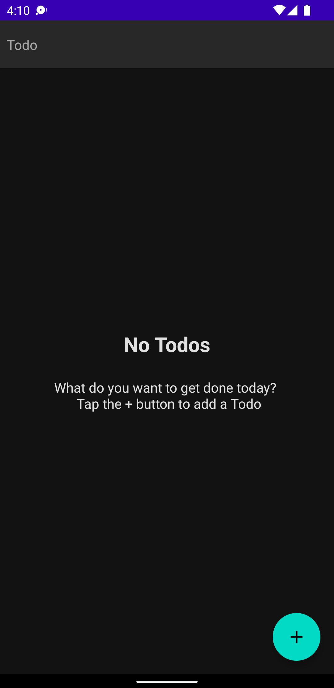
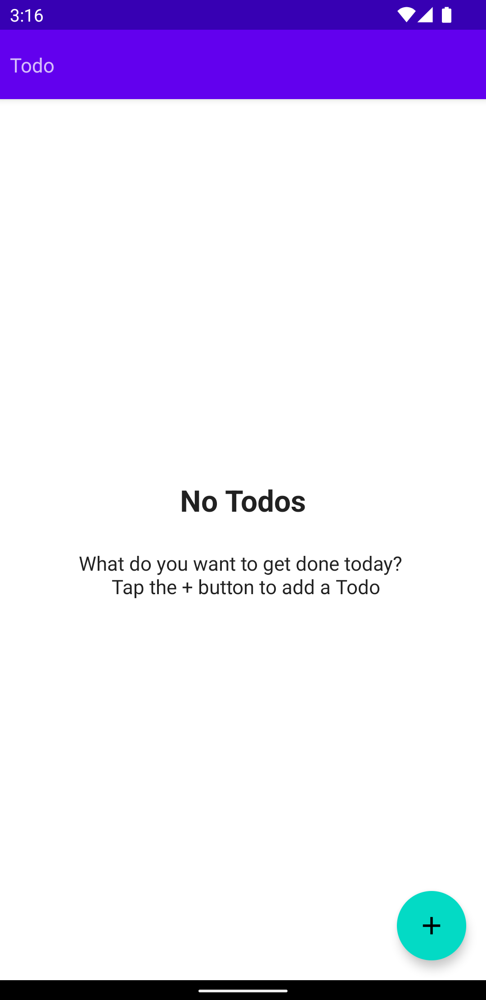
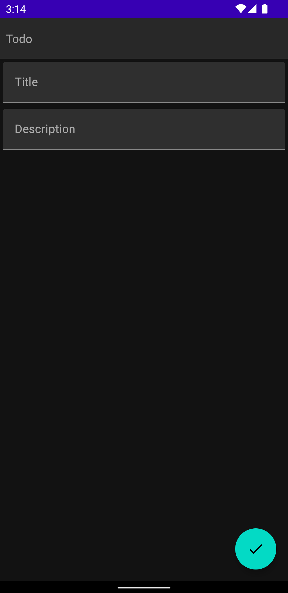
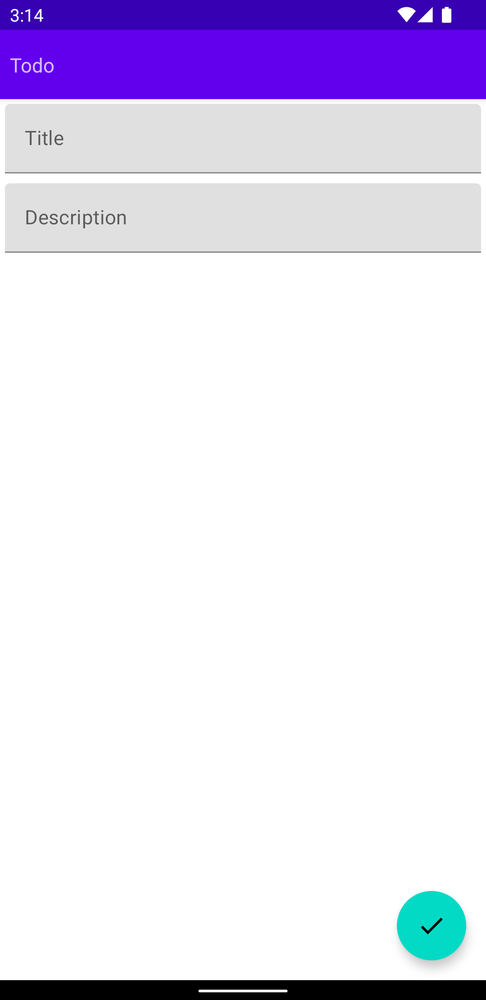
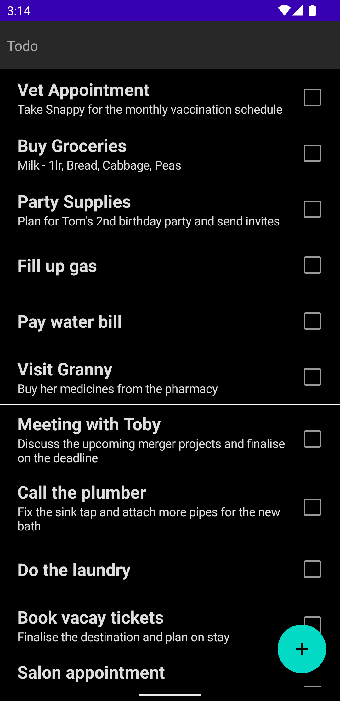
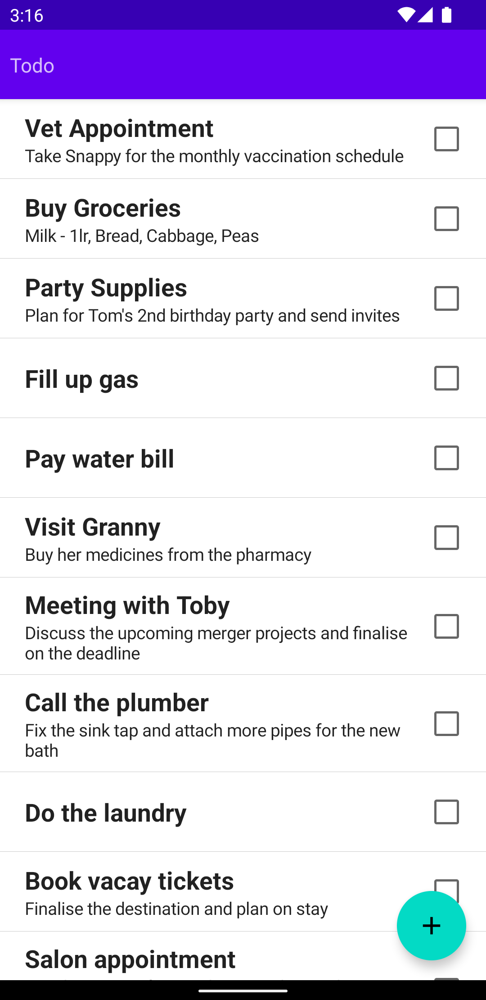
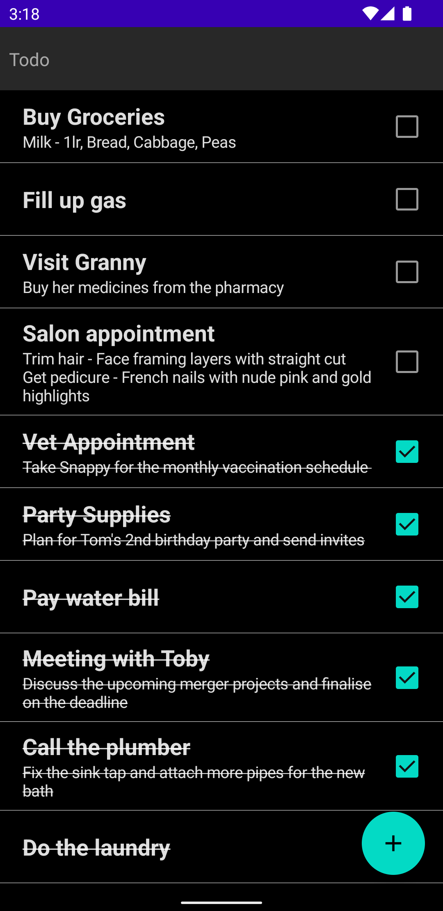
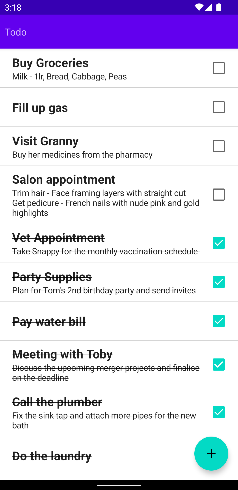
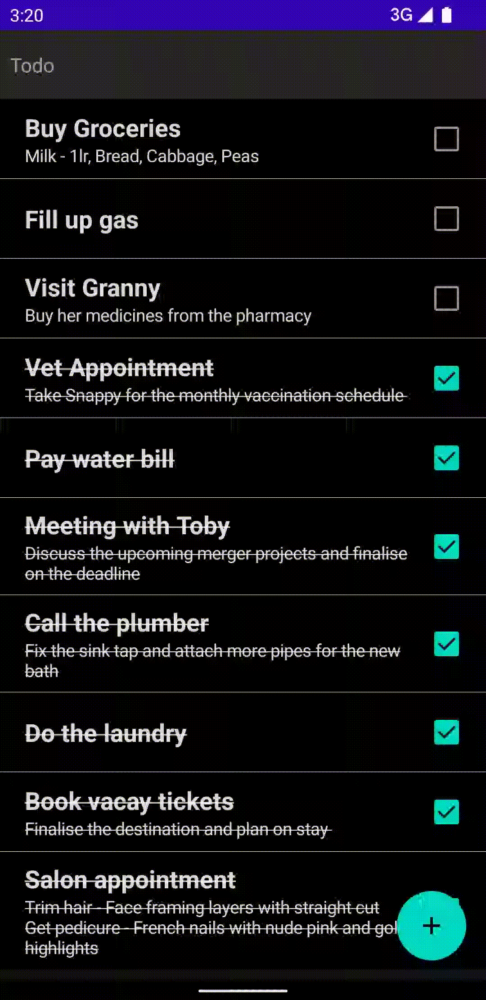

# todo-app
This app built using jetpack compose MVVM architecture 
- Kotlin
- Flow
- Hilt
- Repository Pattern
- Swipe to Delete

# Screenshots

Home page - Dark & Light

 

Add Todo page - Dark & Light

 

Todo list page - Dark & Light

 

Todo Completed - Dark & Light

 

Swipe to Delete Todo

